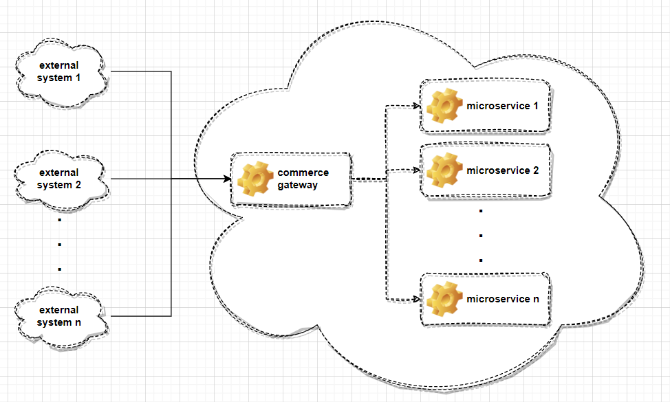
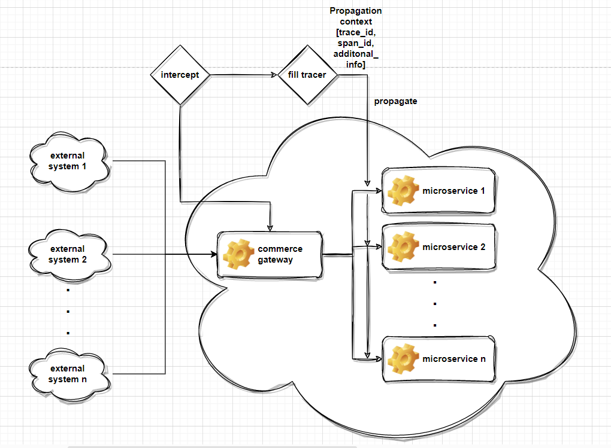
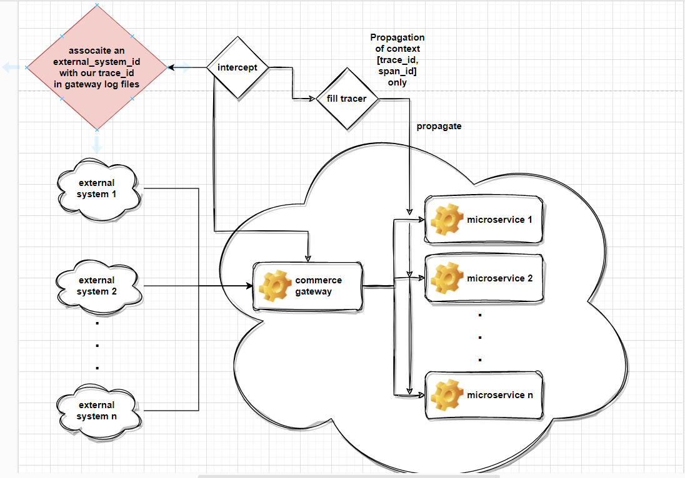

# E-Commerce Distributed Tracing & Logging Architecture


##### Alex Argyriou, Software Engineer on behalf of backend chapter


This document consists of an in depth analysis on how we can 
achieve an integrated distributed tracing & logging environment 
for various spring boot microservices, which 
constitute the base core of the commerce platform.

Document is primarily focused on the recognition of the needs of this specific commerce platform, 
as well as the questions that arise from these specific needs. Each question will be answered 
structured and methodically in order to provide explanations to general tracing & logging problems that are platform independent.

- First things first, what is application **observability** in general ? what is **logging** & what is **tracing** ?

The given section remains as simple as possible while not embraces formal definitions.

---

### Observability
>Both logging & tracing are observability parts. What is observability ?
How well you can understand the internals of your system by examining its outputs. [[observabilty]](https://spring.io/blog/2022/10/12/observability-with-spring-boot-3)

### Logging 
>Logging is a means of tracking and saving events that happen when some software runs. [[logging]](https://www.freecodecamp.org/news/you-should-have-better-logging-now-fbab2f667fac/)

### Tracing
>Distributed tracing is a method of tracking application information, as a request flows from service to service. [[tracing]](https://www.datadoghq.com/knowledge-center/distributed-tracing/#:~:text=Distributed%20tracing%20is%20a%20method,exhibit%20high%20latency%20or%20errors.)

---

Now that we have a bird's eye view about the 2 main observability components that we want to make our components aware of, 
let's discuss some things about the commerce architecture in general in order to make it clear where and why should we apply them.

- More or less in our universe we observe something like that :



As mentioned earlier tracing is a method of tracking application information, as a request flows from service to service.
So Let's suppose that requests from external systems pass through the commerce gateway in order to flow on the main components. 
Considering that, **what's the best place to intercept a request, extract all of its valuable information we want to trace and propagate 
all these information from service to service changing only a single point ?**
Probably commerce gateway.

* Let's think about these additions in the previous topology



* We need to apply two main concepts, intercept incoming requests in a single point and enhance a given tracer with these information, so 
he can auto handle the propagation from service to service.
* Before we talk about these concepts, let's clarify this. **What is a tracer ?**
--- 
### Tracer
> Tracer is the API which is responsible for creating a Span. A Span is the API which is responsible to trace an operation. 
> When a tracer starts tracing, it creates a TraceContext which is associated with 1-N spans. 
> Spans hold context associated with the Trace as the unique trace_id and the individual span_id which are held in the SpanContext and are propagatable.
> On a span we can set custom attributes which **ARE NOT** propagatable. Every tracing tool implements propagation based on a specific propagate implementation 
> of a predefined protocol like W3C propagation [[W3C]](https://www.w3.org/TR/2020/WD-baggage-20201020/) [[tracing]](https://opentelemetry.io/docs/reference/specification/trace/api/#:~:text=Tracer%20is%20the%20class%20responsible,API%20to%20trace%20an%20operation.) 

Now let's deconstruct the 2 steps, starting with the first intercepting part.

---
* Intercept the request in commerce gateway

```java
@Component
@Slf4j
public class SpanInterceptor extends HandlerInterceptorAdapter {
private static final boolean PROCEED = true;
    @Override
    public boolean preHandle(HttpServletRequest request,
                             HttpServletResponse response, Object handler) throws Exception {
        // do some magic
        return PROCEED;
    }
}
```
---

Simple as that. When an http request approaches our gateway we can do some magic before we let it free to fulfill its goals.
The magic should be, an instruction like extract headers from the external system request, attach them to a tracer, and let the tracer propagate them.
More or less our first goal is completed.
* Let's proceed to the second requirement, **we need a Tracer**.

As a tracer we will use an OpenTelemetry agent. Two questions arise, **what is OpenTelemetry**? and **what is an agent**?

---

### OpenTelemetry
> OpenTelemetry is a collection of tools, APIs, and **SDKs**. 
> Use it to instrument, generate, collect, and export telemetry data (metrics, logs, and traces) to help you analyze your software’s performance and behavior.
> 
> An important aspect on this formal definition is the acronym **SDK**. We are talking about a tool that is more than a framework. 
> SDK stands for software development kit. Also known as a devkit, the SDK is a set of software-building tools for a specific platform.
> In simpe words, we can extend and customize the basic open telemetry core with ease.
---

### Agent
> We will cover the aspect of a java agent. 
> Java agents are a special type of class which, by using the Java Instrumentation API, can intercept applications running on the JVM, modifying their bytecode.
> we can attach an agent to an existing application using a vm argument, something like
> 
```java -javaagent:pathToAgentJar -someVMVariables -jar```

So if we use OpenTelemetry above our services as an agent, ***how we can handle the agent from a programmatic aspect?***
An agent modifies the byte code, so it's pretty easy to use a provided openTelemetry api with a single maven dependency
to interact with the agent at runtime.

```xml
<dependency>
    <groupId>io.opentelemetry</groupId>
    <artifactId>opentelemetry-api</artifactId>
    <version>${otel.api.version}</version>
</dependency>
```

In our scenario we use a **splunk-otel-agent-distiribution** with an enhanced logger 
which contains various tracing information inside the logger MDC. [[opentelemtry-agent]](https://github.com/signalfx/splunk-otel-java) [[Connect Java trace data with logs]](https://docs.splunk.com/Observability/gdi/get-data-in/application/java/instrumentation/connect-traces-logs.html#nav-Connect-trace-data-with-logs)
> An MDC of a logger, Mapped Diagnostic Context in general, or MDC in short, is an instrument for distinguishing interleaved log output from different sources.

So the benefit from using the splunk distro is tha we have already enhanced in the MDC the trace_id and the span_id. 
It supports both logback and log4j, SL4J implementations.

We achieved with minimal effort to integrate logs with their relevant tracing information in every service log files.

```text
022-12-21 13:25:01 - [trace_id=1c12f21cc940431ec8c782e4b806c5a1 span_id=efc7755ada1f23ef] 
-  other valuable log info
2022-12-21 13:25:37 - [trace_id=27156a46e92a7d43287c238ff0887cf5 span_id=67e1fa8f3cabe973] 
- other valuable log info
2022-12-21 13:25:38 - [trace_id=b2bd989317986b13e4437f46735071da span_id=c8513e5b91d521d6] 
- other valuable log info
2022-12-21 13:25:39 - [trace_id=c2d7043c7e459cfa924c9f60c920884f span_id=c74073ce0a9f97be] 
- other valuable log info
2022-12-21 13:25:40 - [trace_id=4052b2e31e75b15dbb0c0c145a7cec1e span_id=51bb1f62708a43ff] 
- other valuable log info
2022-12-21 13:25:41 - [trace_id=3963dad15ad4a01e9395ac2ab4c5c1b1 span_id=ea39a3039d9be163] 
- other valuable log info
```

Keep in mind that Tracing and Logging are 2 different concepts, but that's a very interesting achievement when we want to send and correlate our data to a tool like splunk.

---

Is it difficult to export our tracing information in an external collector like jaeger ? Not at all
The OpenTelemetry provides a rich property set to adjust the agent [[opentelemtry-config-props]](https://opentelemetry.io/docs/instrumentation/java/automatic/agent-config/)
so if we define these vm arguments

```java
-Dotel.traces.exporter=jaeger
-Dotel.exporter.jaeger.endpoint=http://localhost:14250
```

we are set and ready to go. Spans are exported on a local jaeger.

---

Now let's discuss the 2 main scenarios of our approach. The **first** scenario, 
which is the one we are following at the moment is to associate external_ids with tracing_ids on commerce gateway logfiles.
The **second** scenario is to propagate w/e we want from service to service, if a need like that will arise in the near future.

At the moment we are following the 1st simpler approach while we do not need to propagate something else. The scenario is described by the below topology:

---

### Scenario 1



We can use the opentelemetry api to retrieve the current trace_id and in the magic section of our interceptor associate it with a given header.

```java
@Override
public boolean preHandle(HttpServletRequest request,
                         HttpServletResponse response, Object handler) throws Exception {
        log.info("apix_id {} -> trace_id {}", request.getHeader("apix-id"), 
            Span.current().getSpanContext().getTraceId());
    return PROCEED;
}
```

---

### Scenario 2

For the second scenario we will try to propagate w/e the external client wants, inside our tracing. 
To achieve that we can use the Baggage Interface provided by OTEL supported by W3C propagator. What is a baggage ?

>Baggage refers to contextual information that’s passed between spans [[Baggage]](https://opentelemetry.io/docs/concepts/signals/baggage/)

As described, nothing else is propagated except the tracing context. We can propagate w/e we want through baggage header
Let's see how this works in code.

```java
@Component
public class CustomHeaderFilter implements Filter {
    @Override
    public void doFilter(ServletRequest request, ServletResponse response, FilterChain chain)
            throws IOException, ServletException {
        MutableHttpServletRequest mutableRequest = 
                new MutableHttpServletRequest((HttpServletRequest) request);
        String interestingHeader = 
                request.getHeader("an interesting header from a client");
        String interestingHeader2 = 
                request.getHeader("an interesting header from a client");
        mutableRequest.putHeader("baggage", "key1=" + interestingHeader 
                + ",key2=" + interestingHeader2);
        chain.doFilter(mutableRequest, response);
    }
}

class MutableHttpServletRequest extends HttpServletRequestWrapper {
    // holds custom header and value mapping
    private final Map<String, String> customHeaders;

    public MutableHttpServletRequest(HttpServletRequest request){
        super(request);
        this.customHeaders = new HashMap<String, String>();
    }

    public void putHeader(String name, String value){
        this.customHeaders.put(name, value);
    }

    public String getHeader(String name) {
        // check the custom headers first
        String headerValue = customHeaders.get(name);

        if (headerValue != null){
            return headerValue;
        }
        // else return from into the original wrapped object
        return ((HttpServletRequest) getRequest()).getHeader(name);
    }

    public Enumeration<String> getHeaderNames() {
        // create a set of the custom header names
        Set<String> set = new HashSet<String>(customHeaders.keySet());

        // now add the headers from the wrapped request object
        @SuppressWarnings("unchecked")
        Enumeration<String> e = 
                ((HttpServletRequest) getRequest()).getHeaderNames();
        while (e.hasMoreElements()) {
            // add the names of the request headers into the list
            String n = e.nextElement();
            set.add(n);
        }

        // create an enumeration from the set and return
        return Collections.enumeration(set);
    }
}
```

We are done, now in every service we can use ```Baggage.current()``` from the opentelemtry api to retrieve w/e we want.

---

Let's think about the most interesting question. How can I enhance my span with the Baggage context. One important thing to remember is that OTEL **is extendable through it's sdk.**
So we can write a custom SpanProcessor, to achieve this scenario. [[otel-extensions]](https://opentelemetry.io/docs/instrumentation/java/extensions/)
[[github discussion]](https://github.com/open-telemetry/opentelemetry-java-instrumentation/discussions/7396#discussioncomment-4460566)
Something like that will do the job.

```java
public class CustomSpanProcess implements SpanProcessor {
  @Override
  public void onStart(Context parentContext, ReadWriteSpan span) {
    Baggage.current().asMap()
            .forEach((key, value) -> span.setAttribute(key, value.getValue()));
  }

  @Override
  public boolean isStartRequired() {
    return true;
  }

  @Override
  public void onEnd(ReadableSpan span) {}

  @Override
  public boolean isEndRequired() {
    return false;
  }

  @Override
  public CompletableResultCode shutdown() {
    return CompletableResultCode.ofSuccess();
  }

  @Override
  public CompletableResultCode forceFlush() {
    return CompletableResultCode.ofSuccess();
  }
}
```

At the end, can enhance our logger MDC with additional Span attributes through ```MDC.put(span attribute)```

---
The last part to be discussed, is **sampling**. Tracing is an expensive process. A pretty common problem is that we want to trace everything, so we can log everything, 
but we don't want to use an expensive exporting operation for each individual trace. This is the case where sampling comes into the game.
**So what is sampling?**

> Sampling means to make a decision not to save all the traces 
> that are created by your application, 
> with the assumption that only some of them are enough 
> to understand patterns in your services and gain better insights. 

There are 3 major sampling techniques supported by otel.

### Head-based sampling
> As the name suggests, head-based sampling means to make the decision to sample or not upfront, at the beginning of the trace.

### Tail-based sampling
> Contrary to head-based sampling, here we make the decision at the end of the entire flow,
> when we already gathered the data. This type of sampling is done at the collector (the backend that receives all the spans) level.
> Very useful when you want to export only traces with errors for example

### TraceIDRatioBased sampling
> Export a fixed percentage of traces for example 1%.

These techniques can be used in mixed scenarios for example Head-based sampling alongside TraceIDRatioBased sampling.

In our case we use **TraceIDRatioBased sampling**. Adding these properties to the agent we can achieve to export 10% of traces,
while everything remains logged.

```java
-Dotel.traces.sampler=traceidratio
-Dotel.traces.sampler.arg=0.1
```


